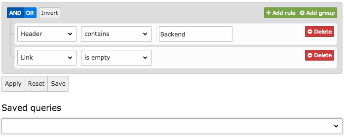

Features and Basic Concept
==========================

The main goal for this querybuilder extension was to use TYPO3s core concepts and add an additional filter functionality for
the list module, enabling editors and developers to search for different attributes on multiple data sets.

For more information see the official documentation of the `jQuery Querybuilder <http://querybuilder.js.org/>`_
