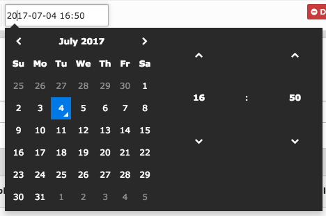

Operators and TCA
=================

The are different operators for different types of data, enabling filtering as the editor wishes.
In general the TCA definition of the field defines the possible operators as e.g. `greater` is only possible for numbers.
The concrete list of possible inputs in combination with the operators:

.. code-block:: js

    equal:            'string', 'number', 'datetime', 'boolean'
    not_equal:        'string', 'number', 'datetime', 'boolean'
    in:               'string', 'number', 'datetime'
    not_in:           'string', 'number', 'datetime'
    less:             'number', 'datetime'
    less_or_equal:    'number', 'datetime'
    greater:          'number', 'datetime'
    greater_or_equal: 'number', 'datetime'
    between:          'number', 'datetime'
    not_between:      'number', 'datetime'
    begins_with:      'string'
    not_begins_with:  'string'
    contains:         'string'
    not_contains:     'string'
    ends_with:        'string'
    not_ends_with:    'string'
    is_empty:         'string'
    is_not_empty:     'string'
    is_null:          'string', 'number', 'datetime', 'boolean'
    is_not_null:      'string', 'number', 'datetime', 'boolean'

Type definition and not supported types
---------------------------------------

   number = integer and double

   datetime = date, time and datetime

.. note::

   Not supported types:

   Timesec - is handled like a simple time eval.

   Year - is handled as string/text

TCA Configuration
-----------------

Most important for the querybuilder is the TCA definition of the filtered field itself, as it
influences the input options.
For example `eval=datetime` causes the filter to generate a datepicker for fitting input and easier usage.

   datetime-picker example

.. tip::

   To get individual table fields into the querybuilder you just need to adapt the table TCA

   `$TCA['ctrl']['queryFilterFields']` enables the wanted fields as filter option. If not defined `$TCA['ctrl']['searchFields']` acts as default.

Specific operator information
-----------------------------

IN
^^
The IN operator is a more specific operator. You can filter for more than one value by only one input.
The complete input is split by separators to the individual values, which are severally checked with equal.

Database-Query logic:

.. code-block:: aspect

    title IN (foo;bar;dong) =>  title = foo OR title = bar OR title = dong

To separate the different values you have to use the defined chars.
**Possible separators are:**
 - ';' (semicolon)
 - '+' (plus)
 - '#' (hash)
 - '|' (pipe)
 - '!' (exlamationmark)

Input examples:
   - foo;bar;dong
   - foo! bar+ dong
   - hello world; that is| the new+ querybuilder

.. note::

   Proper usages for IN are only string input types, as date, integer etc. won't allow the seperator chars.

EMPTY and NULL
^^^^^^^^^^^^^^
.. note::
   Notice the different definition of empty and null:

   - Null: title = null
   - Empty: title = null OR title = ''

