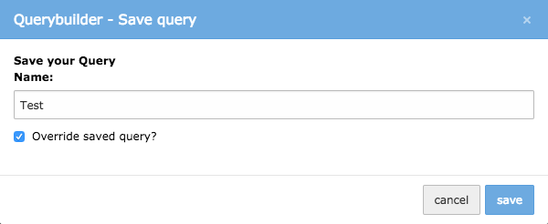

Save Query Functionality
========================

You can save your queries for multiple usages. Queries are saved based on the rules/groups, the userid, the affected table
and the name you can give.

Already saved queries can be overwritten by selecting them in the dialog.

   override functionality

All your queries are listed below the actual builder and each can be chosen by selecting it out of the *"Recent Queries"*-Dropdown.
The queries you saved are only available for yourself and for the specific/affected table.

.. tip::

   For administration of your queries see `Administration <../Administration/Index.html>`_
